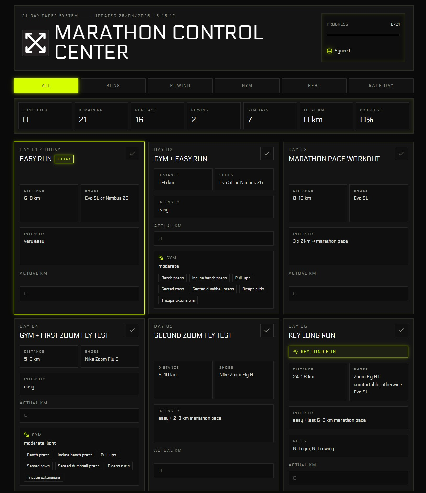

# Marathon Control Center



**Live site:** [avollrath.github.io/marathon](https://avollrath.github.io/marathon/)

Marathon Control Center is a focused 21-day marathon taper dashboard built to track the final weeks before race day. It brings running, gym sessions, rowing, shoe testing, actual kilometre tracking, progress state, backups, and optional Supabase sync into one compact technical interface.

## Why I Built It

I built this as a personal training tool while preparing for a first full marathon. The goal was simple: keep the taper plan clear, reduce friction during the final weeks, and make progress persistent across sessions without turning the workflow into another app to manage.

It is intentionally narrow in scope: a small dashboard for one high-stakes block of training, polished enough to feel deliberate and useful every time it opens.

## Key Features

- 21-day marathon taper plan
- Run, gym, rowing, rest, and race-day filtering
- Actual kilometre tracking for completed sessions
- Persistent progress tracking
- Supabase sync with localStorage fallback
- Export and import backup flow
- Responsive technical dashboard UI
- Neon industrial visual system

## Design Direction

The visual language is dark, minimal, geometric, and industrial. Thin borders, matte panels, a compact dashboard layout, and neon green-yellow accent states give the app the feel of a precision training instrument without pushing it into a flashy gaming style.

The interface uses glow sparingly for active controls, progress, focus states, and completed actions, keeping the overall experience readable and restrained.

## Tech Stack

- React
- Vite
- TypeScript
- Supabase
- localStorage
- Tailwind CSS

## Data Persistence

The app is offline-first. It reads and writes progress to `localStorage` immediately, so the dashboard remains usable without a network connection or Supabase project.

Supabase sync is optional. When `VITE_SUPABASE_URL` and `VITE_SUPABASE_ANON_KEY` are provided at build time, the app syncs the shared progress record remotely. Without those variables, it continues to work locally.

## Local Development

```bash
npm install
npm run dev
npm run build
```

## Environment Variables

Create a local `.env` file from `.env.example` and provide your Supabase values:

```bash
VITE_SUPABASE_URL=
VITE_SUPABASE_ANON_KEY=
```

Do not commit `.env`. Only publishable client keys belong in Vite frontend configuration.

## Supabase Table

```sql
create table if not exists training_progress (
  id text primary key,
  data jsonb not null,
  updated_at timestamptz not null default now()
);
```

The app stores the progress payload as JSON so the training state can evolve without reshaping the table for every UI change.

## Deployment

Marathon Control Center builds as a static Vite app and can be deployed to GitHub Pages or any static host.

Vite environment variables must be available at build time if remote Supabase sync should be enabled in the deployed version.
